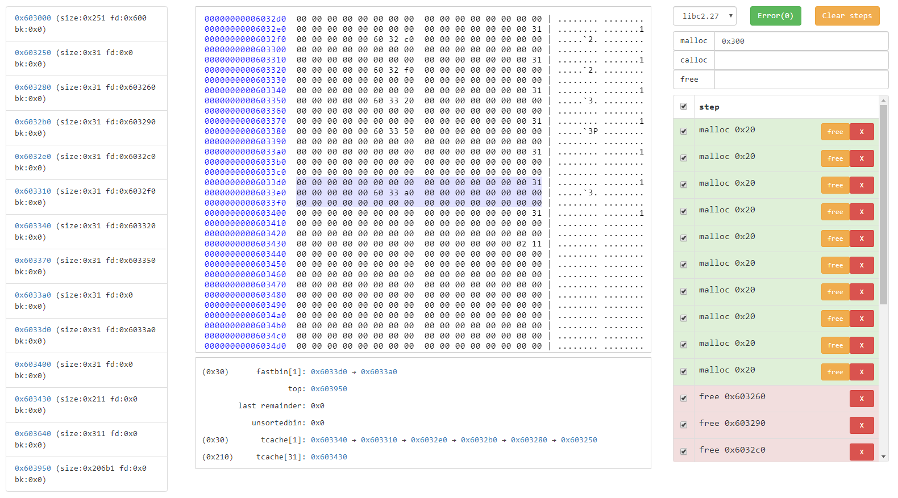
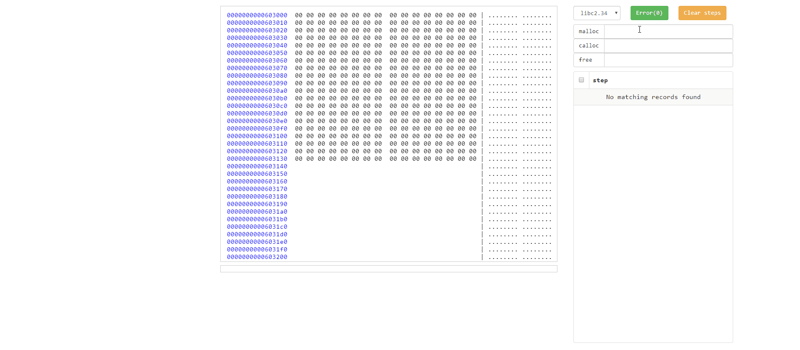

# heap-sim-gui
一个图形化显示堆信息的小工具。

A simple graphical website to simulate heap info.




## Description / 描述

heap-sim-gui是用于展示对信息的图形化工具。可以自由使用malloc、free和修改块信息，并将堆内存、bins等信息显示在界面上，支持2.23-2.34间的大部分版本的glibc。

Heap-sim-gui is a simple graphical utility that displays heap info. You can malloc / free / edit chunks and then browse the heap memory and heap info(tcache/fastbin/smallbin...) by it. And it support many glibs from glibc2.23 to glibc2.34.


## Install / 安装

### 直接安装

需要安装python2.7和第三方库。

Need to install some python lib.

```bash
pip install -r requirements.txt
```

### 使用docker

需要加上配置`--security-opt seccomp=sec.conf`，才能正常运行。

You need to use `--security-opt seccomp=sec.conf`.

```bash
docker build -t heap-sim-gui .
docker run --security-opt seccomp=sec.conf -itd -p 5000:5000 heap-sim-gui
```


## Launch  / 启动

进入项目文件夹后启动网站，然后使用浏览器访问网址 http://127.0.0.1:5000。

Launch the website after enter this folder, then visit http://127.0.0.1:5000 .

```bash
cd heap-sim-gui
python app.py
```


## Usage / 使用

可以对堆进行申请、释放、修改，可以更直观地观察堆的变化。

You can use malloc / free / edit the heap chunks to view the change of data. 




## License / 许可证

Released under the [MIT License](LICENSE).


## Thanks / 致谢

- [heapinspect](https://github.com/matrix1001/heapinspect)


